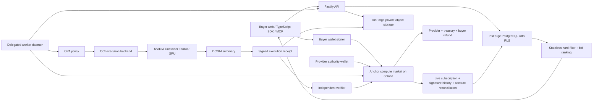
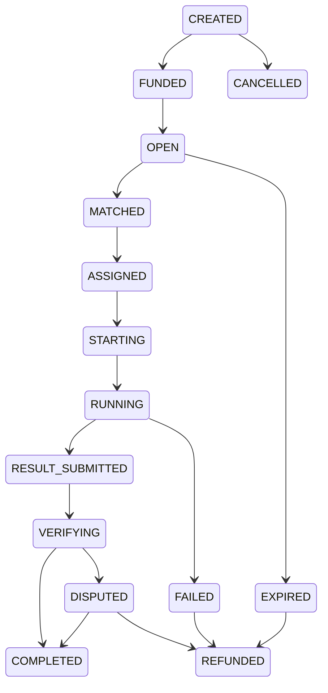
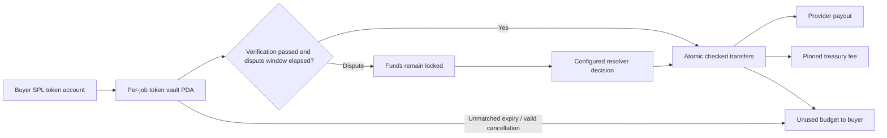
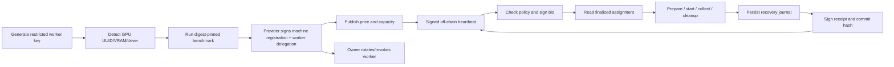

# Vericompute — pre-implementation design

Vericompute is a replaceable working name. InsForge owns off-chain persistence, identity and private objects. Solana alone owns token escrow and authoritative economic state. No API-admin key has authority to move buyer tokens. This document describes the target; implementation evidence and remaining work belong in README.md.

## Research and reuse matrix

| Source | Existing capability | Reuse decision | Rewrite | License / maintenance | Concern |
|---|---|---|---|---|---|
| Nosana programs | Solana market/job/run, staking, pools, rewards | PDA and role-separation concepts | USDC reverse-auction contract and verification state machine | MIT; unarchived at inspected SHA | README explicitly warns most code is unaudited |
| Nosana indexer/kit/node | Client, container orchestration, live indexing with GPA and history recovery | Architectural patterns only | Typed SDK, isolated worker, independent cursor pipeline | No root license identified in inspected snapshots; no code copying | Websocket-only recovery loses events; mutable container configuration |
| Akash provider/node | Orders, bids, leases, inventory, Kubernetes deployment | Bid filtering, independent bid engine and execution adapter concepts | Solana instruction/account integration | Apache-2.0; unarchived at inspected SHA | Cluster privileges and provider resource overcommit |
| Prime protocol/prime | Worker/validator/discovery split; GPU procurement CLI | Independent verification and simple procurement UX | Receipt policy and Solana economics | Protocol Apache-2.0, archived; CLI MIT, unarchived | Archived protocol must not be critical dependency |
| Bacalhau | Orchestrator, compute nodes, execution and storage adapters | Interface modularity | Marketplace-specific execution adapter | Apache-2.0; unarchived at inspected SHA | Engine isolation and input/output handling |
| Ray/KubeRay | Distributed actors, GPU scheduling, placement groups | Future adapter only | No distributed scheduling in MVP | Verify source snapshots in inventory before adopting | Exposed cluster control planes; unnecessary single-job complexity |
| io.net public org | Public setup, launchers, examples | Onboarding UX research only | All marketplace protocol logic | Per-repository license; no blanket reuse | Public binaries do not establish access to internal source |

Sources and exact commits: [research inventory](../research/inventory.json). Unknown or inaccessible evidence is recorded as unknown, never inferred as permissive.

## Feature gap matrix

This is a comparison of inspected public material, not an assertion that a competitor cannot provide a feature privately.

| Capability | Nosana | Akash | Prime public protocol | Our target |
|---|---|---|---|---|
| Container compute | Jobs/runs | Leases/Kubernetes | Worker tasks | OCI jobs |
| Competitive procurement | Market queue | Order/bid/lease | Orchestration | Intent + signed competitive bid |
| Solana economic state | Yes | Different chain | Different economic layer | Yes |
| USDC job escrow | Not adopted from source | Not adopted from source | Not adopted from source | Approved classic SPL mint, six-decimal USDC default |
| Receipt-bound settlement | Completion flow | Lease payments | Validators/challenges | Image/input/output/timing/worker commitments |
| Per-machine reputation | Source-dependent | Source-dependent | Hardware checks | Separate provider and machine histories |
| Bounded autonomous spend | Not established by inspection | Not established by inspection | Not established by inspection | V2 delegated spending policy |

GPU catalogs, wallet connection, Docker execution, telemetry, price filters, and generic bidding duplicate existing infrastructure. The proposed differentiation is their composition into agent-oriented compute intents with evidence-bound USDC settlement, explicit assurance levels, independent verifiers, and machine-specific reliability. This is a product hypothesis, not a proven moat.

## Architecture

Adjacent stages may be atomic in one transaction; account state is never updated by arbitrary client enum assignment.

Accounting: deposit = provider_payment + protocol_fee + buyer_refund; integer base units only. Execution failure and invalid receipt cannot be relabeled successful by the API.

## Account contract

All IDs use 32-byte values and canonical PDA bumps. Token vaults use the classic SPL Token program. Program initialization pins admin, approved mint, treasury, verifier and resolver; changes are restricted to admin. Mainnet must use a multisig upgrade authority.

| Account | Seeds | Fields / authority |
|---|---|---|
| ProtocolConfig | config | admin, mint, treasury, verifier, resolver, fee_bps<=300, pause flag, dispute duration |
| Provider | provider, authority | authority, metadata hash, status, completed/failed/disputed counters, collateral |
| WorkerAuthorization | worker, provider, worker | provider, worker, active, expiry; provider controls delegation |
| Machine | machine, provider, id | provider, worker auth, hardware hash, benchmark hash, trust level, status |
| Offer | offer, machine, id | machine, rate in base units/sec, min/max seconds, expiry, active |
| Job | job, buyer, id | buyer, spec hash, mint, budget, deadline, timeout, policy, state, selected provider/machine/worker, receipt hash, verification, settled flag |
| Bid | bid, job, provider | job, provider, machine, price, estimated start, expiry; provider signs |
| Assignment | assignment, job | selected bid, worker, start limit; can be embedded in Job in MVP |
| Escrow | escrow, job | classic token vault owned by Job PDA; deposit accounting stored in Job |
| ReceiptCommitment | receipt, job | receipt hash and submission time; can be embedded in Job in MVP |
| Verification | verification, job, verifier | receipt hash, policy, decision, evidence hash; trusted verifier in MVP |
| Dispute | dispute, job | buyer, reason/evidence hash, resolution, amounts |
| AgentPolicy (V2) | agent-policy, owner, agent | mint allowlist commitment, per-job/day limits, expiry, atomic day counter, required policy |

## Instruction contract

| Instructions | Signer and mandatory validation |
|---|---|
| initialize_protocol | Deployment initializer; one canonical config, mint/treasury checks, fee cap |
| update_protocol, pause_protocol | Admin; changes must not retroactively alter job fee/settlement parties |
| register_provider, update_provider | Provider authority; immutable authority and counters |
| authorize_worker, rotate_worker, revoke_worker | Provider authority; scoped delegation and expiry |
| register_machine, update_machine, deactivate_machine | Provider authority; same provider/worker and no unproven hardware upgrade |
| create_offer, update_offer, pause_offer, close_offer | Provider; machine belongs to provider, bounded rate/duration/expiry |
| create_job | Buyer; immutable spec commitment, bounded budget/deadlines/timeout, valid policy |
| fund_job | Buyer; approved mint, source owner, canonical vault, exact checked transfer |
| open_job | Buyer; funded deposit sufficient and start deadline not elapsed |
| place_bid, cancel_bid | Provider; registered active machine/worker, same job, bounded amount, expiry |
| accept_bid, assign_offer | Buyer; bid belongs to job, price fits escrow, active worker/machine, no prior assignment |
| start_job | Assigned active worker; within start deadline, correct provider/machine |
| submit_receipt | Assigned active worker; running, one immutable nonzero commitment |
| submit_verification | Authorized independent verifier; current receipt hash and policy, terminal decision |
| complete_job | Valid verification and timing; preserves dispute period |
| fail_job | Assigned worker or authorized verifier; recorded failure |
| cancel_job | Buyer; before assignment only |
| expire_job | Permissionless; chain clock proves start/execution expiry |
| open_dispute | Buyer; before dispute window ends; freezes payout |
| resolve_dispute | Configured resolver; conservation, capped fee, never scheduler unilateral slashing |
| refund_job | Anyone may trigger valid refund to pinned buyer token account; no caller-selected destination |
| settle_job | Anyone may trigger passed verification after window; pinned accounts, conservation, single settlement |
| create_agent_policy, update_agent_policy, revoke_agent_policy | V2 owner only; per-job/day accounting atomic in chain transaction |

## Wire formats

Canonical JSON is RFC 8785; SHA-256 over UTF-8 canonical bytes. All signed envelopes include domain, version, cluster genesis hash, program ID and type. Monetary values are decimal strings of base units; time is integer Unix seconds. Signatures are Ed25519. Never concatenate ambiguous strings to form commitments.

- **ComputeJobSpecV1:** version=1, runtime=oci, image={repository,digest}, command:string[], resources={gpu:{count,minimumVramMb,allowedModels},cpuCores,ramMb,storageMb}, execution={timeoutSeconds,maxStartDelaySeconds}, network={mode:deny-by-default,allow:[]}, verification={policy:BASIC|STANDARD}, inputs:{uri,sha256}[]. Reject unknown fields, mutable tags, unbounded resources and privileged options.
- **ExecutionReceiptV1:** version, domain, cluster, program, jobId, jobSpecHash, provider, machineId, worker, imageDigest, inputRoot, outputRoot, startTimestamp, finishTimestamp, exitCode, gpuUuidCommitment, hardwareReportHash, telemetryHash, stdoutHash, stderrHash, resultHash, nonce. Signature is outside signed payload.
- **BidV1:** version, domain, cluster, program, jobId, provider, machineId, worker, priceBaseUnits, estimatedStart, expiresAt, nonce, signature.
- **HeartbeatV1:** version, domain, cluster, program, machineId, worker, timestamp, availableGpuCount, load, runningJobs, benchmarkHash, nonce, signature. Short TTL, durable nonce uniqueness; never per-heartbeat chain writes.
- **HardwareReportV1:** version, machineId, worker, gpu:[{model,uuid,vramMb,driver,cuda}], cpuCores, ramMb, diskMb, capturedAt, nonce, signature. A provider claim is CLAIMED until a reproducible benchmark establishes BENCHMARKED; neither is attestation.

## Verification trust model

BASIC (VERIFY_0) establishes a signed provider claim. STANDARD (VERIFY_1) checks worker signature, finalized assignment/delegation, exact job/image/input commitments, output bytes, timing and evidence consistency. It does not prove correct computation or confidentiality: a provider can fabricate internally consistent telemetry. VERIFY_2 challenges, VERIFY_3 redundancy, VERIFY_4 attestation and VERIFY_5 proofs are future policies and must be rejected while unsupported. The MVP verifier is explicitly trusted and separate from provider; its availability is operationally important. Off-chain objects may expose plaintext to workers. Only commitments go on-chain.

## Top twenty threats

1. Missing signer: Anchor Signer constraints on every authority path.
2. PDA substitution: canonical seeds, stored relations and bump constraints.
3. Wrong payment mint: pinned config/job mint and token account constraints.
4. Arbitrary token program/CPI: fixed classic SPL program.
5. Double settlement/refund: terminal flags and atomic chain transaction.
6. Receipt replay: domain/cluster/program/job/nonce binding and unique receipt.
7. Fake worker: active provider delegation checked at execution/commit.
8. Revoked worker: inspect current delegation; do not accept cached authorization.
9. Expired/substituted bid: job/provider/machine links and chain-clock checks.
10. Verifier impersonation: explicit authorized verifier signer.
11. Treasury substitution: snapshot recipient and fee when funding.
12. Integer overflow: checked arithmetic, integer tokens, bounded fee.
13. Agent daily race: defer unsupported delegation; V2 atomic on-chain counter.
14. Container escape: rootless, cap-drop, seccomp, no-new-privileges, hardened runtime tiers.
15. Host/network/socket access: no host mounts/namespaces/devices; deny network by default.
16. Resource exhaustion: PID/memory/CPU/disk/log/time limits and cleanup.
17. Malicious input URLs: private object access; no arbitrary server-side URL fetching.
18. Fabricated hardware/evidence: honest trust labels; STANDARD is not a compute proof.
19. Missed/reordered chain events: finalized reconciliation and independent signature-history cursor.
20. InsForge tenant leakage/key compromise: RLS, narrow grants, private objects, server-only admin credentials.

## Repository layout

Root is the vericompute workspace (no redundant nested project folder). apps/{web,api,scheduler,indexer,verifier,gateway}; agents/provider-node; programs/compute-market; packages/{sdk,solana,types,job-spec,receipts,verification,pricing,policy,config,ui}; executors/{mock,docker}; infra/{compose,kubernetes,monitoring,scripts}; migrations; scripts; tests; docs; research/upstream (ignored). Future containerd/Ray/vLLM implementations are deferred until implemented, not empty placeholder classes.

## License strategy

Record SHA, paths and license in OPEN_SOURCE_RESEARCH.md. Copy no upstream application code in MVP; reuse published permissive dependencies and architectural ideas with attribution. GREEN=MIT/Apache/BSD/ISC; YELLOW=MPL/LGPL; REVIEW=GPL/AGPL/SSPL/source-available/unknown. Missing license is not permission. Archived Prime/Nox/MinIO are not runtime dependencies. Generate dependency notices and preserve dependency license files.
